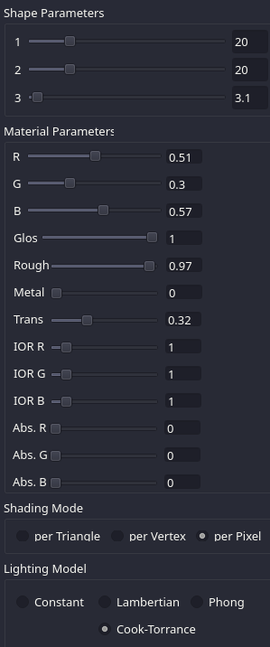
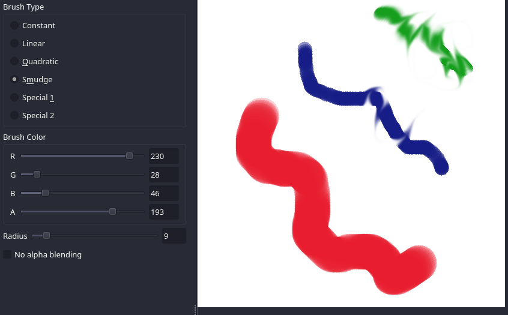
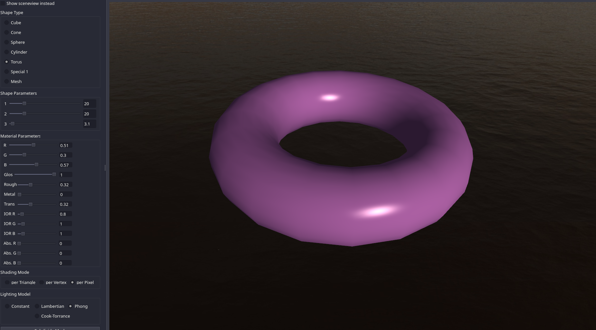
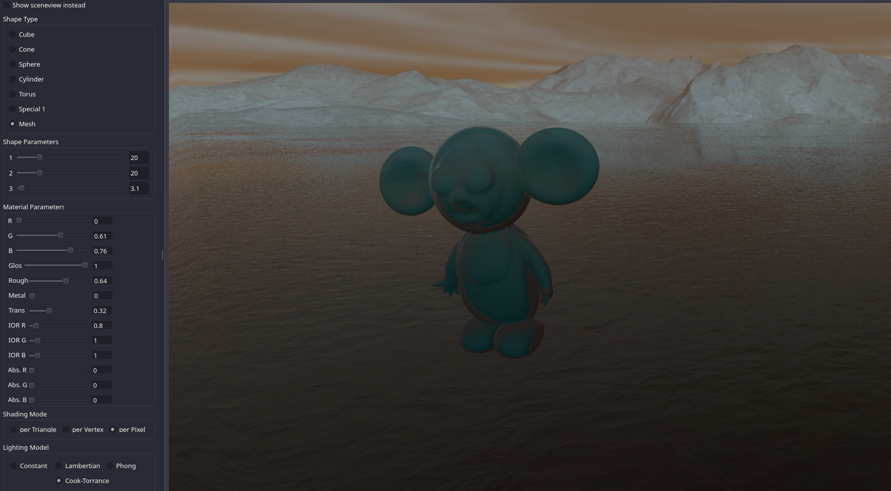
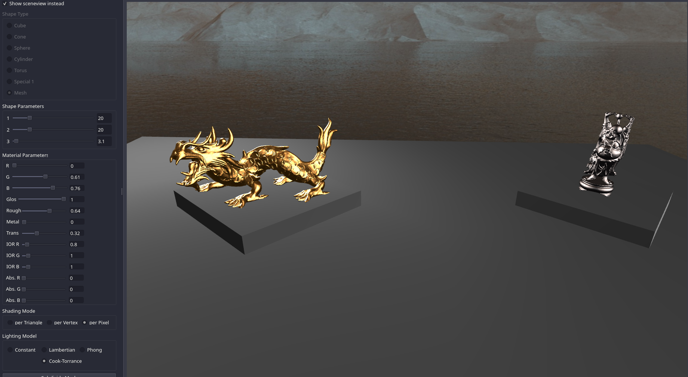

# CS123Projects
A collection of projects for 2D drawing and image manipulation and 3D rendering, all backed by OpenGL. Image creator includes several brushes and filters including a Fourier Transform implementation.
3D renderer includes a number of shading paradigms including physically based shading based on the Cook-Torrance BRDF. Mesh and scene loading is also supported.

Based on the excellent project stencil and course notes for Brown University's CS123. Stencil is at https://github.com/cs123tas/projects

# Usage
Program features a full GUI for manipulating the painting program, and 3D renderer.

3D renderer features GUI options for switching between different shading modes (per triangle, per vertex, per pixel) and different reflection models (constant, Lambertian, Phong, Cook-Torrance).

Various sliders are available for manipulating material parameters in real time.

# Examples
Drawing program demonstrating various brushes:

3D renderer demonstrating the plastic appearance of Blinn-Phong shading on a torus:

Demonstration of model loading and transparency:

Demonstration of scene loading, and metallic materials using the Cook-Torrance BRDF:

